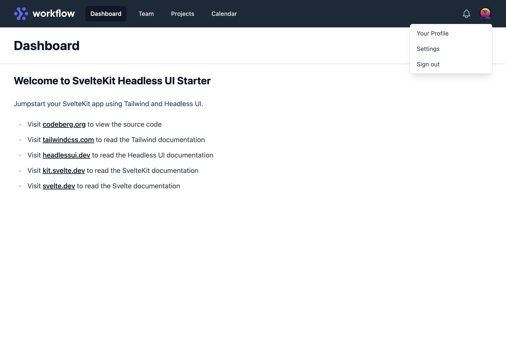

# SvelteKit Headless UI Starter

🚀 Launch your SvelteKit app with Tailwind and Headless UI.

## Highlights

- 🎨 Tailwind CSS with Forms and Typography plugins
- 🧪 Headless UI via [@rgossiaux/svelte-headlessui](https://github.com/rgossiaux/svelte-headlessui)
- 💄 Prettier with Tailwind automatic class sorting
- 🚩 Unplugin Icons for access to all [Icônes](https://icones.js.org/) icons
- ⚡️ Cssnano stylesheet compression for prod builds
- 📝 Changesets for automated changelog generation
- 🏗️ Project structure modeled from [svelte-starter](https://github.com/navneetsharmaui/sveltekit-starter)
- 🚚 Dynamic global navigation driven by API calls
- 📈 Basic SEO with large social sharing cards

## Demo

View the [online demo](https://sveltekit-headlessui-starter.vercel.app) to try it out.

## Screenshot



## Developing

Once you've created a project and installed dependencies with `pnpm install`, start a development server:

```bash
pnpm run dev

# or start the server and open the app in a new browser tab
pnpm run dev -- --open
```

### Adding a changeset

To add a changeset run `pnpm changeset` and follow the prompts.

## Building

To create a production version of your app:

```bash
pnpm run build
```

You can preview the production build with `npm run preview`.

> To deploy your app, you may need to install an [adapter](https://kit.svelte.dev/docs/adapters) for your target environment.

### Creating a version

To create a new version run `pnpm changeset version` and follow the prompts.

## Publishing

Update package name in `package.json` for your project then run `pnpm changeset publish` followed by `git push --follow-tags`. Assumes you have logged into NPM and have a git remote configured already.

## Deploying

To deploy your software to Vercel create a Vercel account (requires a phone number) then run `pnpm deploy` or `pnpm deploy -- --prod`. If you're creating a static site, consider swapping out `adapter-auto` with [`adapter-static`](https://www.npmjs.com/package/@sveltejs/adapter-static) and deploy to [Codeberg Pages](https://codeberg.page/) as an ethical alternative to commercial hosting.

## Continuous Integration

[Request access](https://codeberg.org/Codeberg-CI/request-access) to become an early adopter of Codeberg CI. Codeberg CI uses [Woodpecker](https://woodpecker-ci.org/), a fork of Drone, and is built around principles of software freedom.
