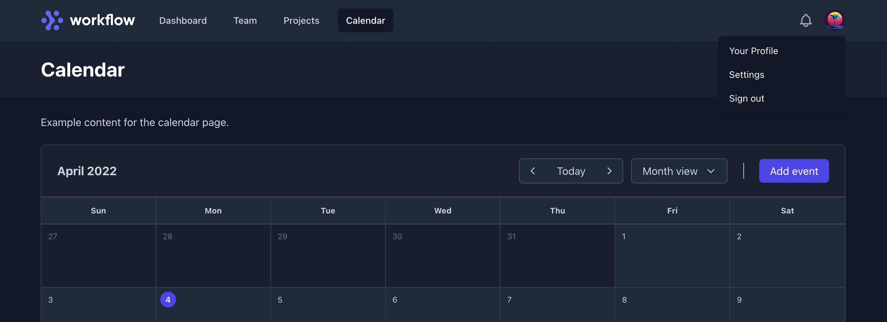

[](https://npmjs.com/svelte-headlessui-starter)
[](https://npmjs.com/svelte-headlessui-starter)
[](https://github.com/sveltejs/kit/blob/master/packages/kit/CHANGELOG.md#100-next391)
[](https://codeberg.org/vhs/svelte-headlessui-starter/src/branch/trunk/COPYING)

# Svelte Headless UI Starter

Launch your next Svelte app using Headless UI.



Template designed to make it faster and easier to build libre Svelte apps using Headless UI.

## Demo

View the [online demo](https://svelte-headlessui-starter.vercel.app) to see what you can expect.

## Highlights

- 🏗️ [SvelteKit](https://kit.svelte.dev/) cybernetically enhanced routing
- 🔨 [Svelte](https://svelte.dev/) for developing fast, lightweight apps
- 🎨 [Tailwind CSS](https://tailwindcss.com/) with Forms and Typography plugins
- 🧪 [Headless UI](https://svelte-headlessui.goss.io) for a sophisticated, accessible UI
- 💄 [Prettier](https://prettier.io/) with Tailwind automatic class sorting
- 🚩 [Unplugin Icons](https://github.com/antfu/unplugin-icons) to access to all [Icônes](https://icones.js.org/) icons
- ⚡️ [Cssnano](https://cssnano.co/) for production stylesheet compression
- ⚡️ [Service Worker](https://developer.mozilla.org/en-US/docs/Web/API/Service_Worker_API/Using_Service_Workers) dynamic resource caching
- ✏️ [Fontsource](https://fontsource.org/) self-hosted web font integration
- 🎭 [Playwright](https://playwright.dev/) browser testing framework
- 🦋 [Changesets](https://github.com/changesets/changesets) to manage versioning and changelogs
- 📈 [Basic SEO](https://github.com/oekazuma/svelte-meta-tags) with large social sharing cards
- 🚀 [Vercel](https://vercel.com/) deployments functional out of the box
- 🔐 [OAuth](https://www.oauth.com/) via GitHub, extendible to other providers
- ⚗️ [Supabase](https://supabase.com/) integration utilizing GraphQL
- 🦄 [GraphQL](https://graphql.org/) language server via remote schema
- 👷 [Gravitar](https://gravatar.com/) support for non-logged in users
- 📄 [AGPL](https://www.gnu.org/licenses/agpl-3.0.en.html)-licensed free (as in freedom) software

## Structure

The application structure is as follows:

```term
├── src
│   ├── db
│   ├── environment
│   ├── hooks
│   ├── lib
│   │   ├── core
│   │   │   └── services
│   │   │       ├── auth
│   │   │       ├── graphql
│   │   │       ├── http
│   │   │       └── supabase
│   │   ├── data
│   │   ├── graphql
│   │   ├── models
│   │   │   ├── classes
│   │   │   ├── interfaces
│   │   │   └── types
│   │   ├── shared
│   │   │   ├── components
│   │   │   │   ├── auth
│   │   │   │   ├── calendar
│   │   │   │   ├── form
│   │   │   │   ├── meta
│   │   │   │   └── navigation
│   │   │   └── layouts
│   │   └── utils
│   └── routes
│       ├── account
│       └── api
│           ├── auth
│           └── user
├── static
└── tests
```

## Setup

Copy `.env.example` to `.env` before running the app. The app will run using the defaults provided, however, OAuth configuration is required to access protected routes and Supabase is required for dynamic behaviors such as adding events to the included Calendar component.

### OAuth

To configure authentication using GitHub as an OAuth provider create an OAuth app as described in [Creating an OAuth App](https://docs.github.com/en/enterprise-server@3.4/developers/apps/building-oauth-apps/creating-an-oauth-app) then fill out the `GITHUB_` prefixed items in your `.env` file with those provided by GitHub. OAuth is enabled during development by default although it will not function without an active provider.

### Supabase

To use Supabase create a new project on the [Supabase website](https://supabase.com/) then fill out the `SUPABASE_` prefixed items in your `.env` file with those provided by Supabase. Afterwards run `src/db/setup.sql` from within the Supabase online SQL Editor to configure and seed your database. Supabase is disabled during development by default.

#### GraphQL

Supabase can be used with REST and GraphQL via the `pg_graphql` extension which is enabled by default for projects created after Mar 28, 2022. This starter utilizes a simple GraphQL client to access some Supabase data and, as a result, requires `pg_graphql` to be enabled in order to function when Supabase is used. The `setup.sql` file contains the necessary configuration for GraphQL and no additional steps are required.

Visit [Activate and Use Supabase GraphQL](https://vhs.codeberg.page/post/activate-use-supabase-graphql/) to understand how it works.

GraphQL language server features such as query completions will begin to function automatically once the `.env` file is configured. See `.graphqlrc.yml` for setup. Using this approach you do not need to duplicate server schema in your app. Assumes you're using an editor plug-in which understands how to read [graphql-config](https://graphql-config.com).

## Developing

Once you've completed setup and installed dependencies with `pnpm install`, start a development server:

```bash
pnpm run dev

# or start the server and open the app in a new browser tab
pnpm run dev -- --open
```

By default development builds will not utilize Supabase. This behavior can be controlled using the `debug` flag in `environment.dev.ts`. If you have already setup Supabase, set the debug flag to `false` to develop using live data.

### Making commits

Use the approach that best suits your personal preferences and preferred work style. If you would like to add emojis to your commit messages, see [Emojify Conventional Commits with Git](https://vhs.codeberg.page/post/emojify-conventional-commits-git/) for one approach.

### Adding a changeset

To add a changeset run `pnpm changeset` and follow the prompts. If this is your first time adding a changeset, run `pnpm changeset init` to create the `.changeset` folder and commit it to the repository.

## Building

To create a production version of your app:

```bash
pnpm run build
```

You can preview the production build with `npm run preview`.

By default production builds will utilize Supabase. This behavior can be controlled using the `debug` flag in `environment.prod.ts`. If you have not yet setup Supabase or do not wish to use it, set the debug flag to `true` to deploy using mock data.

## Versioning

To create a new version run `pnpm changeset version` and follow the prompts.

## Publishing

To publish a new version run `pnpm changeset publish` to generate a `CHANGELOG`, followed by `git push --follow-tags`. Assumes you have logged into NPM and have a git remote configured.

## Deploying

Supported deployment environments include Vercel, Cloudflare and Netlify. Other environments may be supported in the future. See [adapter-auto](https://www.npmjs.com/package/@sveltejs/adapter-auto) for list of automatically supported environments.

Note that although Cloudflare uses Node to build the project its SSR functionality is performed in Web Workers. As a result, code that requires Node explicitly such as `dotenv` is forbidden. Reference the `engines` property in `package.json` for the minimum Node version required to build the project regardless of deployment target used.

### Vercel

To deploy your app to Vercel run `vercel` for testing or `vercel --prod` for production. Assumes you've signed-up for and authenticated with Vercel from the [Vercel CLI](https://vercel.com/cli). No additional configuration is required. If you wish to create a Continuous Integration (CI) setup with a git repo connected to Vercel, consult the Vercel docs.

### Cloudflare Pages

You can get a CI setup running without any additional configuration as described in the [Cloudflare Docs for Svelte](https://developers.cloudflare.com/pages/framework-guides/deploy-a-svelte-site/). See [Wrangler Configuration](https://developers.cloudflare.com/workers/cli-wrangler/configuration/) and [here](https://github.com/sveltejs/kit/issues/2966) for CLI-based deployments, which are a bit more involved.

#### Error 1102: Worker exceeded resource limits

Once you've deployed to Cloudflare Pages, if you see the error indicated that means you've gone over the CPU budget during server-side rendering. Cloudflare set a 50ms budget for Functions (Workers) during the beta. Enable the `debug` flag in `environment.prod.ts` and try again.

## Rights

Svelte Headless UI Starter - Launch your next Svelte app using Headless UI.<br>
Copyright (C) 2022&nbsp;&nbsp;VHS &lt;vhsdev@tutanota.com&gt; (https://vhs.codeberg.page)

Svelte Headless UI Starter is free software: you can redistribute it and/or modify it under the terms of the GNU Affero General Public License as published by the Free Software Foundation, either version 3 of the License, or (at your option) any later version.
